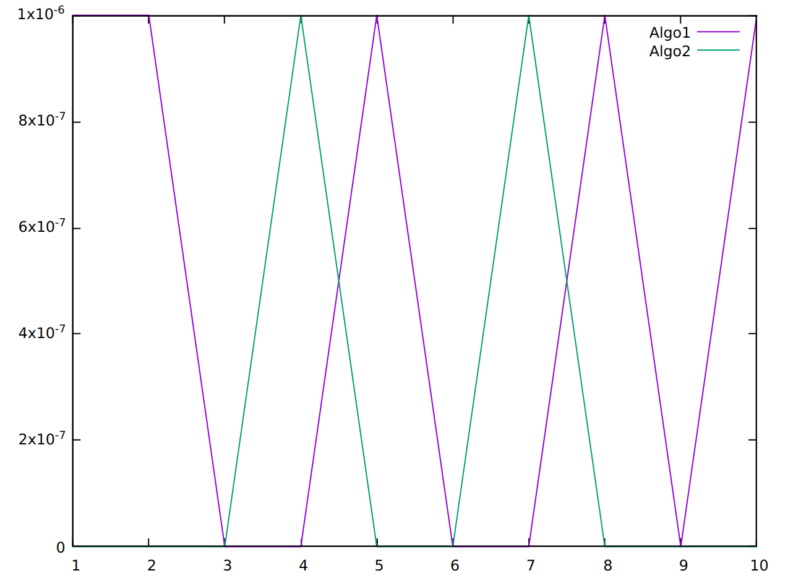
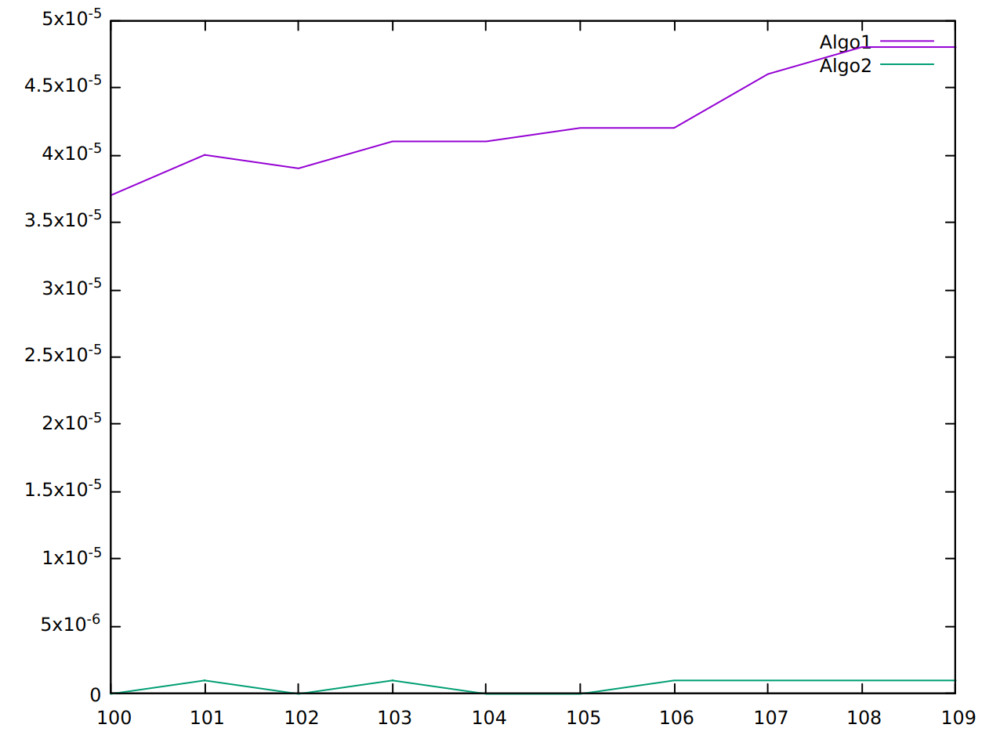
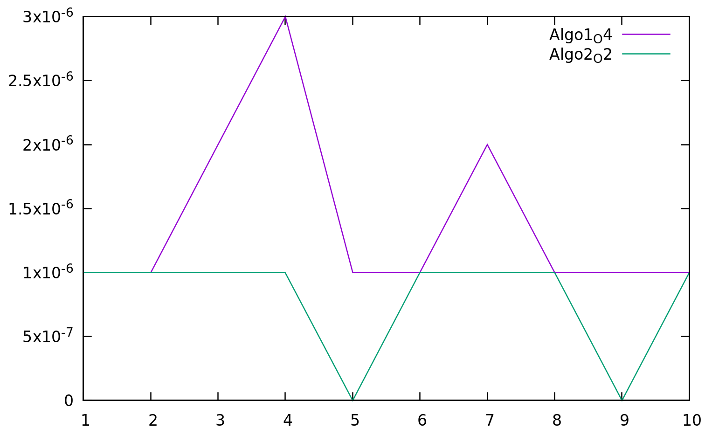
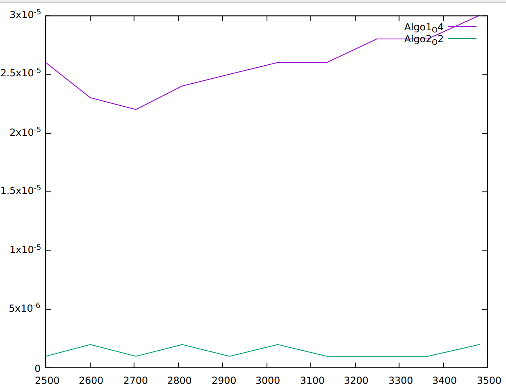
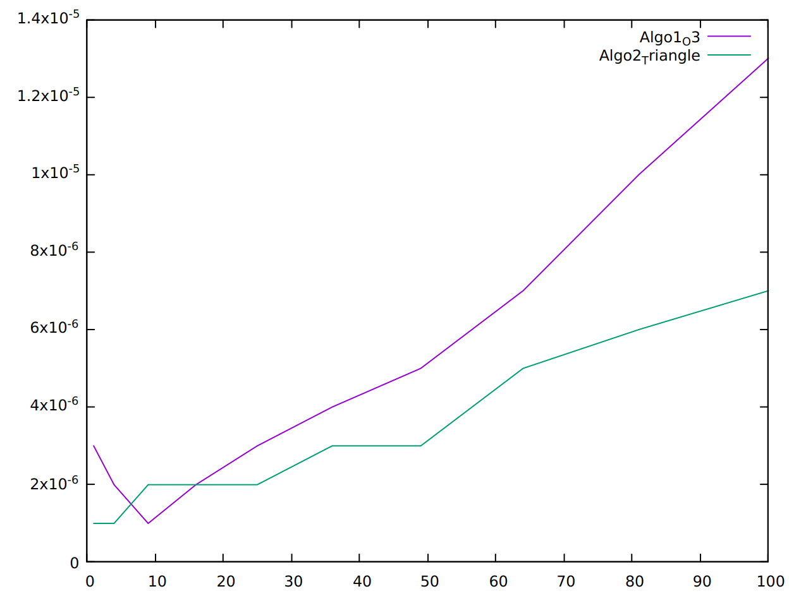
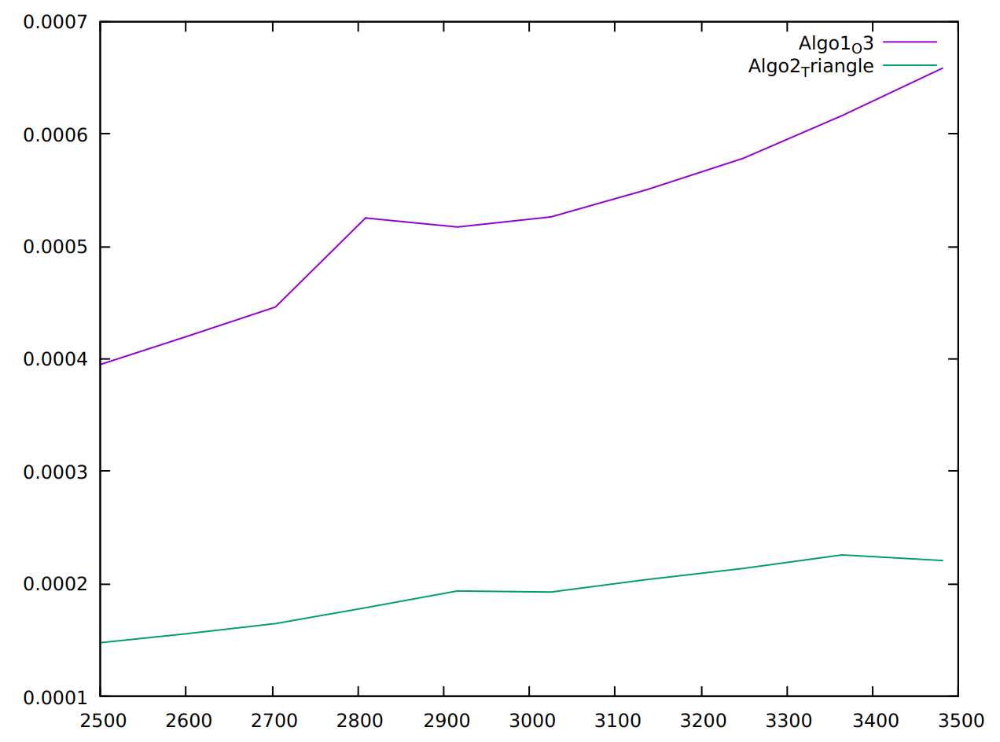

# Mini Projet 01 Structure de données

**Membre du binome**

- Hamid Kolli 28717594
- Amayas Sadi 28717408

---

## EXERCICE 1

### Partie 1

#### Question 1

- A la lecture :

Le programme crée un tableau de 10 cases et il le remplie (chaque case à l'indice i contient la valeur i)

- Au lancement :

On lance le programme
```sh
./tme1_exo1p1
```

- Ce qui se passe :

Le programme s'arretera suite à une erreur de segmentation.

#### Question 2

- La valeur i aprés l'itération ou il vaut 0 est de 4294967295 (qui correspond à la valeur maximale de unsigned int)

- Pour sortir de la boucle i doit valoir -1 (< 0)

- Il veux accéder à une case qui n'est pas allouée pour le programme et dont l'indice est de 4294967295

- La case n'est pas allouée donc on a pas le droit d'accéder vu qu'elle est utiliser par un autre processus

#### Question 3

- Enlever le unsigned pour que i puisse avoir une valeur negatif qui est -1 et sortir de la boucle

### Partie 2

### Question 1

- Le programme est censé creer une adresse `12 rue manoeuvre 15670` et l'afficher

- La compilation et l'execution :

```sh
    gcc -o tme1_exo1p2 tme1_exo1p2.c 
    ./tme1_exo1p2
```

- Ce qui se passe :

Le programme s'arretera suite a une erreur de segmentation.

### Question 2

```sh
    gcc -ggdb -o tme1_exo1p2 tme1_exo1p2.c 
    gdb tme1_exo1p2

    break 15 
    run
    print new->rue
   >>$1 = 0x0
```

- On voit la valeur 0x0 qui correspond à la valeur NULL pour les pointeurs

- On constate que lorsque on continue l'execution on aura une erreur de segmentation, l'erreur survient lors de l'execution de l'instruction suivante :

```c
    strcpy(new->rue, r);
```

- La cause de l'erreur :

On a pas allouer la memoire pour le pointeur `new->rue` donc on a voulue copier des octets dans un espace non allouer

- La solution est d'utiliser `strdup`

```c
new->rue = strdup(r);
```

### Partie 3

#### Question 1

- Le programme crée une variable de type Tableau (une structure) qui a une taille maximale de 100, ajoute dedans 5 entiers et affiche le tableau

- La compilation et l'execution :

```sh
    gcc -o tme1_exo1p3 tme1_exo1p3.c
    ./tme1_exo1p3
```

- Le programme s'execute correctement et affiche :

```'
t->position = 5
[ 5 18 99999 -452 4587 ]
```

#### Question 2

- Les problemes sont :

> Il n'a pas liberer le pointeur tableau qui est dans la structure Tableau avant de liberer la structure elle meme

*Autres problemes*

> Il n'a pas verifier si le tableau est plein avant de l'ajout

> Il n'a pas verifier le bon deroulment des allocations

> Il n'a pas verifier si les pointeurs pointent vers une addresse (different de NULL)

#### Question 3

- On constate qu'l y a une fuite memoire de 400 octets

> cette ligne nous indique que on a fait 3 allocations et on a liberer que 2

```'
total heap usage: 3 allocs, 2 frees, 1,440 bytes allocated
```

> donc y'a une fuite de memoire de 400 octets comme l'indique cette ligne

```'
definitely lost: 400 bytes in 1 blocks
```

- les 400 octets correspondent au tableau tab qui se trouve dans la structure

#### Question 4

- La correction est de liberer le tableau avant de liberer la structure

---

## Exo 2

### Partie 1

#### Question 1 / 2
Voir fichiers `tableau.c` et `algo.c`

#### Question 3

Avec des valeurs pour la taille de 1 à 10



Avec des valeurs pour la taille de 100 à 109




- On remarque que dans les cas des valeurs petites pour la taille la vitesse des algorithmes est presque la meme, ils sont sur une meme echelle, mais dés que la valeur de la taille grandi on aura un ecart net qui se crée entre les temps des deux algorithmes

- Si la taille est assez grande on voit que les temps de cpu obtenu avec algo2 sont beaucoup plus bas que ceux obtenu avec algo1, et ca s'explique avec les complexites, un algorithme avec une complexite lineaire est bien plus rapide qu'un autre avec une complexite quadratique.

*Ici y'a pas de pire cas car on va parcourir tout les tableaux, ce qui affecte les performances c'est la taille du tableau*

### Partie 2

#### Question 4 et 5
VOir fichiers `matrice.c` et `algo.c`

On voit que toujours l'algorithme avec la compléxité en O(4) prend beaucoup plus de temps par apport au deuxieme algorithme (qui lui est en O(2))

Avec peu d'elements



Avec beaucoup d'elements



#### Question 6

- 1 et 2 Voir fichier `algo.c`

- 3 Il est toujours de même complexité i.e O(n³) (C'est o(n*m*p) Avec M1 : M(n*m) et M2 : M(m * p))

    On a juste reduit les itérations de la boucle mais toujours on fait au moins une fois n. (On aura un facteur de n³ < au facteur initial, sinon c'est toujours o(n³))


Avec peu d'elements



Avec beaucoup d'elements

