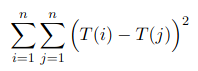

# Mini Projet 01 Structure de données

**Membre du binome**

- Hamid Kolli 28717594
- Amayas Sadi 28717408

---
## Makefile 

On a automatise les dessins des courbes avec des fichiers de commande et des regles dans le makefile qui lance le gnuplot

```sh
CC = gcc
CFLAGC = -Wall -g

PROGS = mesure_tab mesure_mat_verif mesure_mat_prod
all: $(PROGS)

%.o : %.c %.h
	$(CC) $(CFLAGC) -o $@ -c $<

mesure_tab : tableau.o matrice.o algo.o mesure_tab.o
	$(CC) $(CFLAGC) -o $@ $^

mesure_mat_verif : tableau.o matrice.o algo.o mesure_mat_verif.o
	$(CC) $(CFLAGC) -o $@ $^

mesure_mat_prod : tableau.o matrice.o algo.o mesure_mat_prod.o
	$(CC) $(CFLAGC) -o $@ $^

plot_tab :
	gnuplot -p < commande_tab.txt

plot_mat_verif :
	gnuplot -p < commande_mat_verif.txt

plot_mat_prod :
	gnuplot -p < commande_mat_prod.txt

clean :
	rm -rf $(PROGS) *.o *.ps sortie_vitesse_*.txt
```

## Exercice 1

### Partie 1

#### Question 1

- A la lecture :

Le programme crée un tableau de 10 cases et il le remplie (chaque case à l'indice i contient la valeur i)

- Au lancement :

On lance le programme
```sh
./tme1_exo1p1
```

- Ce qui se passe :

Le programme s'arretera suite à une erreur de segmentation.

#### Question 2

- La valeur i aprés l'itération ou il vaut 0 est de 4294967295 (qui correspond à la valeur maximale de unsigned int)

- Pour sortir de la boucle i doit valoir -1 (< 0)

- Il veux accéder à une case qui n'est pas allouée pour le programme et dont l'indice est de 4294967295

- La case n'est pas allouée donc on a pas le droit d'accéder vu qu'elle est utiliser par un autre processus

#### Question 3

- Enlever le unsigned pour que i puisse avoir une valeur negatif qui est -1 et sortir de la boucle

### Partie 2

### Question 1

- Le programme est censé creer une adresse `12 rue manoeuvre 15670` et l'afficher

- La compilation et l'execution :

```sh
    gcc -o tme1_exo1p2 tme1_exo1p2.c 
    ./tme1_exo1p2
```

- Ce qui se passe :

Le programme s'arretera suite a une erreur de segmentation.

### Question 2

```sh
    gcc -ggdb -o tme1_exo1p2 tme1_exo1p2.c 
    gdb tme1_exo1p2

    break 15 
    run
    print new->rue
   >>$1 = 0x0
```

- On voit la valeur 0x0 qui correspond à la valeur NULL pour les pointeurs

- On constate que lorsque on continue l'execution on aura une erreur de segmentation, l'erreur survient lors de l'execution de l'instruction suivante :

```c
    strcpy(new->rue, r);
```

- La cause de l'erreur :

On a pas allouer la memoire pour le pointeur `new->rue` donc on a voulue copier des octets dans un espace non allouer

- La solution est d'utiliser `strdup`

```c
new->rue = strdup(r);
```

### Partie 3

#### Question 1

- Le programme crée une variable de type Tableau (une structure) qui a une taille maximale de 100, ajoute dedans 5 entiers et affiche le tableau

- La compilation et l'execution :

```sh
    gcc -o tme1_exo1p3 tme1_exo1p3.c
    ./tme1_exo1p3
```

- Le programme s'execute correctement et affiche :

```'
t->position = 5
[ 5 18 99999 -452 4587 ]
```

#### Question 2

- Les problemes sont :

> Il n'a pas liberer le pointeur tableau qui est dans la structure Tableau avant de liberer la structure elle meme

*Autres problemes*

> Il n'a pas verifier si le tableau est plein avant de l'ajout

> Il n'a pas verifier le bon deroulment des allocations

> Il n'a pas verifier si les pointeurs pointent vers une addresse (different de NULL)

#### Question 3

- On constate qu'l y a une fuite memoire de 400 octets

> cette ligne nous indique que on a fait 3 allocations et on a liberer que 2

```'
total heap usage: 3 allocs, 2 frees, 1,440 bytes allocated
```

> donc y'a une fuite de memoire de 400 octets comme l'indique cette ligne

```'
definitely lost: 400 bytes in 1 blocks
```

- les 400 octets correspondent au tableau tab qui se trouve dans la structure

#### Question 4

- La correction est de liberer le tableau avant de liberer la structure

---

## Exercice 2

#### Description des fichiers .c et .h

- Le fichier tableau.h et tableau.c 
  
Le fichier `tableau.h` contient les prototypes des fonctions élémentaires pour les traitements des tableaux (allocation, désallocation, remplissage et affichage) dont le code est dans le fichier `tableau.c`

- Le fichier algo.h et algo.c

Le fichier `algo.h` contient les prototypes des fonctions qui représentes les algorithmes sur les tableaux et les matrices, le corps de ces fonctions se trouve dans le fichier `algo.c`

- Le fichier matrice.h et matrice.c

Les prototypes des fonctions élémentaires sur les matrices se trouvent dans le fichier `matrice.h` (allocation des matrices, désallocation des matrices, affichage et remplissage des matrices), les matrices carré non triangulaire sont représentées par un tableau de tableaux d'entier de la même taille (pointeur sur pointeur d'entiers) parcontre les matrices traingulaires sont représentées par une structure qui contient la taille et le type de la matrice ainis que un tableau de tableaux d'entier dont les tailles varies.

```c
typedef struct _matrice_triangulaire {
    int **matrice;
    int taille;
    // 1 pour superieure et 0 pour inferieure
    int orientation;
} MatriceTriangulaire;
```

- Le fichier commun.c

Contient une constante commune entre les fichiers de mesures et une macro pour l'affichage des erreurs

### Partie 1

#### Question 1.1

On a choisis le protoype suivant `int *alloue_tableau(int taille)` pour ne pas utiliser le déréférencement dans la fonction

Le code de la fonction `alloue_tableau`

```c
// Permet d'allouer un tableau d'une taille donnee
int *alloue_tableau(int taille) {

    int *tableau = malloc(sizeof(int) * taille);

    if(tableau == NULL)
        print_probleme("Erreur d'allocation");

    return tableau;
}
```

#### Question 1.2

Voici le code de la fonction `desalloue_tableau`

```c
// Permet de liberer un tableau
void desalloue_tableau(int *tableau) {
    free(tableau);
}
```

#### Question 1.3

Le code de la fonction `remplir_tableau`

```c
// Permet de remplire un tableau random
void remplir_tableau(int *tableau, int taille, int valeur) {
    if(!tableau) return;

    for(int i = 0; i < taille; i++)
        tableau[ i ] = rand() % valeur; 
}
```

#### Question 1.4

Le code de la fonction `afficher_tableau`

```c
// Permet d'afficher un tableau
void afficher_tableau(int *tableau, int taille) {
    if(!tableau) return;

    for(int i = 0; i < taille; i++)
        printf("%-5d ", tableau[ i ]);
    
    printf("\n");
}
```

#### Question 2.1

On calcule 



Voici l'algorithme de complexite O(N²)

```c
// permet de faire la somme de la difference carre des case d'un tableau en O(n²)
int somme_1(int *tableau, int taille) {
    int somme = 0;

    if(tableau) {
        for(int i = 0; i < taille; i++)
            for (int j = 0; j < taille; j++)
                somme += (tableau[ i ] - tableau[ j ]) * (tableau[ i ] - tableau[ j ]);
    }

    return somme;
}
```

#### Question 2.2

On a utilise cette méthode pour simplifier le calcul et obtenir une complexité de O(N)

```'
SommeI_0_N(SommeJ_0_N (Ti-Tj)²) 

= SommeI_0_N(SommeJ_0_N Ti² + Tj² - 2 TiTj) 

= SommeI_0_N(SommeJ_0_N Ti²) + SommeI_0_N(SommeJ_0_N Tj²) - 2 SommeI_0_N(SommeJ_0_N TiTj)

= 2 SommeI_0_N(SommeJ_0_N Ti²) - 2 SommeI_0_N(Ti)² 

= 2 * N * SommeI_0_N(Ti²) - 2 SommeI_0_N(Ti)²
```

```c
// permet de faire la somme de la difference carre des case d'un tableau en O(n)
int somme_2(int *tableau, int taille) {
    int sommeX = 0;
    int sommeXCarre = 0;

    for(int i = 0; i < taille; i++) {
        sommeX += tableau[ i ];
        sommeXCarre += tableau[ i ] * tableau[ i ];
    }

    return 2 * taille * sommeXCarre - 2 * sommeX * sommeX;
}
```

#### Question 3

Avec une petite taille de tableau : 


Avec des valeurs pour la taille de 100 à 109


- **Analyse**

- On remarque que dans les cas des valeurs petites pour la taille la vitesse des algorithmes est presque la meme, ils sont sur une meme echelle, mais dés que la valeur de la taille grandi on aura un ecart net qui se crée entre les temps des deux algorithmes

- Si la taille est assez grande on voit que les temps de cpu obtenu avec algo2 sont beaucoup plus bas que ceux obtenu avec algo1, et ca s'explique avec les complexites, un algorithme avec une complexite lineaire est bien plus rapide qu'un autre avec une complexite quadratique.


### Partie 2

#### Question 4

Voici le codes des fonctions :

```c
// Permet d'allouer une matrice carre n*n
int **alloue_matrice(int n) {

    int **matrice = malloc(sizeof(int *) * n);

    if(!matrice) {
        print_probleme("Erreur d'allocation");
        return NULL;
    }

    // On alloue tous les tableaux
    for(int i = 0; i < n ; i++)
        matrice[ i ] = alloue_tableau(n);

    return matrice;
}

// Permet de desalouer l'espace alloue a une matrice carre de taille n
void desalloue_matrice(int **matrice, int n) {

    // On desaloue tous les tableaux
    for(int i = 0; i < n; i++)
        desalloue_tableau(matrice[ i ]);
    
    free(matrice);
}

// Permet de remplir une matrice carre de taille n avec des valeurs entre 0 et valeur
void remplir_matrice(int **matrice, int n, int valeur) {

    // On remplie tous les tableaux
    for(int i = 0; i < n; i++)
        remplir_tableau(matrice[ i ], n, valeur);
}

// Permet d'afficher une matrice carre de taille n
void afficher_matrice(int **matrice, int n) {
    // Affiche tous les tableaux
    for(int i = 0; i < n; i++)
        afficher_tableau(matrice[ i ], n);
}
```

#### Question 5

Algorithme de complexite O(N⁴) : 

```c
// permet de vericier si toutes les valeurs d'une matrice sont differentes en O(n⁴)
int verfie_matrice_1(int **matrice, int n) {
    for(int i = 0; i < n; i++) {
        for(int j = 0; j < n; j++) {
            for(int k = 0; k < n; k++) {
                for(int l = 0; l < n; l++) {
                    if(i != k && j != l && matrice[i][j] == matrice[k][l])
                        return 0;
                }
            }
        }
    }
    return 1;
}
```

Algorithme de complexite O(N²) en utilisant un tableau de borne maximale

```c
// permet de vericier si toutes les valeurs d'une matrice sont differentes en O(n²)
int verfie_matrice_2(int **matrice, int n, int maxValeur) {

    // On alloue le tableau le tableau de borne
    int *check = alloue_tableau(maxValeur);

    //on utilise un tableau de maxValeur de valeurs comme tableau de booleen (0 si il n'existe pas 1 sinon)
    for(int i = 0; i < maxValeur; i++)
        check[ i ] = 0;

    for(int i = 0; i < n; i++) {
        for(int j = 0; j < n; j++) {
            if(check[matrice[i][j]] != 0) {
                // on desaloue le tableau de boolean
                desalloue_tableau(check);
                return 0;
            }
            check[matrice[i][j]] = 1;
        }
    }

    // on desaloue le tableau de boolean
    desalloue_tableau(check);
    return 1;
}
```

Avec peu d'elements


Avec beaucoup d'elements


- **Analyse**

- Avec des petites tailles pour les matrice on voit que la difference n'est pas grande entre les deux algorithme de complexite O(N⁴) et O(N²), mais dés que on grandit la taille des matrice on voit rapidement la difference les temps de l'agorithme dont la complexite est de O(N⁴) prend des valeurs énormes par apport à celui de complexité quadratique 

#### Question 6

L'algorithme de produit matricielle de complexite O(N³)

```c
//permet de faire le produit matricielle
int **produit_mat_1(int **mat1, int **mat2, int m) {
    
    int **prod = alloue_matrice(m);
    if(!prod) return NULL;

    // c'est la somme du produit ligne * colonne
    for(int i = 0; i < m; i++) {
        for(int j = 0; j < m; j++) {
            prod[i][j] = 0;
            for(int k = 0; k < m; k++)
                prod[i][j] += mat1[i][k] * mat2[k][j];
        }
    }

    return prod;
}
```

On a represente les matrice triangulaire par une structure

```c
typedef struct _matrice_triangulaire {
    int **matrice;
    int taille;
    // 1 pour superieure et 0 pour inferieure
    int orientation;
} MatriceTriangulaire;
```

Et on a définit les fonctions d'allocation, désallocation, remplissage et affichage pour cette nouvelle structure, voici leurs code

```c
// Permet d'allouer une matrice triangulaire
MatriceTriangulaire *alloue_matrice_triangulaire(int taille, int orientation){
    
    // On alloue la structure
    MatriceTriangulaire *matrice = (MatriceTriangulaire *) malloc(sizeof(MatriceTriangulaire));
    
    if(!matrice){
        print_probleme("Erreur d'allocation");
        return NULL;
    }

    // Si c'est pas 0 ou 1 on mets par défaut à 1
    if(orientation != 0 && orientation != 1)
        orientation = 1;

    matrice->orientation = orientation;
    matrice->taille = taille;

    // On alloue le tableau de pointeurs
    matrice->matrice = (int **) malloc(sizeof(int *) * taille);
    
    if(!matrice) {
        print_probleme("Erreur d'allocation");
        free(matrice);
        return NULL;
    }

    // On parcours les lignes
    for(int i  = 0; i < taille; i++) {

        /*
        * On alloue pour la ligne i le nombre de cases correspondantes
        * Avec la formule : (orientation * (taille-i) + (1 - orientation) * ( i+1 ))
        */
        matrice->matrice[i] = alloue_tableau((orientation * (taille-i) + (1 - orientation) * ( i+1 )));
        
        if(!matrice->matrice[i]) {

            print_probleme("Erreur d'allocation");

            // On libere tous ce qu'on a déja allouer
            for(int j = 0; j < i; i++)
                free(matrice->matrice[j]);
            
            free(matrice->matrice);
            free(matrice);
            return NULL;
        }
    }

    return matrice;
}

// Permet de remplir une matrice traingulaire avec des valeurs entre 0 et valeur
void remplir_matrice_triangulaire(MatriceTriangulaire *matrice, int valeur) {

    if(!matrice) {
        print_probleme("Pointeur invalide");
        return;
    }

    // On parcours les lignes
    for(int i = 0; i < matrice->taille; i++) 
        // On remplir les tableau de chaque ligne (la taille du tableau est donnée avec la meme formule lors de l'allocation)
        remplir_tableau(matrice->matrice[i], matrice->orientation * (matrice->taille-i)+ (1 - matrice->orientation) * ( i+1 ), valeur);
    
}

// Permet de liberer l'espace allouer pour une matrice triangulaire
void desalloue_matrice_triangulaire(MatriceTriangulaire *matrice) {
    
    if(!matrice) {
        print_probleme("Pointeur invalide");
        return;
    }

    // On libere les tableaux dans chaque ligne
    for(int i = 0; i < matrice->taille; i++)
        desalloue_tableau(matrice->matrice[i]);
    
    free(matrice->matrice);
    free(matrice);
}

// Permet d'afficher une matrice triangulaire
void afficher_matrice_triangulaire(MatriceTriangulaire *matrice){

    if(!matrice) {
        print_probleme("Pointeur invalide");
        return;
    }

    // On parcours les lignes
    for (int i = 0; i < matrice->taille; i++) {   

        // Si superieure on affiche les i premieres 0
        for (int j = 0; matrice->orientation && j < i; j++)
            printf("%-5d ", 0);
        
        // On affiche les elements de la ligne
        for (int j = 0; j <  matrice->orientation * (matrice->taille-i) + (1 - matrice->orientation) * ( i+1 ); j++)
            printf("%-5d ",matrice->matrice[i][j]);

        // Si inferieure on affiche les i derniers 0
        for (int j = 0; !matrice->orientation && j < matrice->taille - i - 1; j++)
            printf("%-5d ", 0);
        
        printf("\n");
    }   
}
```

* Voici l'agorithme qui calcule le produit matriciel entre une matrice triangulaire superieure et inferieure de complexite O(N³)

```c
//permet de faire le produit matricielle entre deux matrice triangulaire sup * inf
int **produit_triang(MatriceTriangulaire *sup, MatriceTriangulaire *inf) {

    if(sup->taille != inf->taille) {
        print_probleme("Les matrice ne sont pas de la même taille");
        return NULL;
    }

    if(!sup->orientation || inf->orientation){
        print_probleme("Prbleme d'incompatibilité");
        return NULL;
    }

    int **prod = alloue_matrice(sup->taille);

    if(!prod){ 
        print_probleme("Erreur d'allocation de la matrice");
        return NULL;
    }

    int debut = -1;

    // c'est la somme du produit ligne * colonne
    for(int i = 0; i < sup->taille; i++) {
        for(int j = 0; j < inf->taille; j++) {  
            prod[i][j] = 0;

            debut = i < j ? j : i;
            for(int k = debut; k < sup->taille; k++)
                prod[i][j] += sup->matrice[i][k-i] * inf->matrice[k][j];
        } 
    }

    return prod;
}
```

Avec peu d'elements


Avec beaucoup d'elements


- **Analyse**
  
- Les deux algorithmes sont de même complexité i.e O(n³). On a juste reduit les itérations de la boucle pour le deuxieme. (On aura un facteur de n³ inferieur au facteur de premier algorithme)
  
  Le caclule de complexite pour l'algorithme 2

    Pour i = 0 On fait N iteration dans la 2eme boucle et N iteration dans la 3eme

    Pour i = 1 On fait N iteration dans la 2eme boucle et N-1 iteration dans la 3eme

    ...

    Pour i = N-1 On fait N iteration dans la 2eme boucle et 1 iteration dans la 3eme

    Donc le nombre d'operation c'est cette somme

    N*N + N * (N-1) + ... + N = N * (N + N-1 + ... + 1) = N * (N * (N+1)) / 2 = 1/2 N³ + 1/2 N²

- Pour une petite taille de la matrice on voit que la difference de temps entre les deux algorithmes n'est pas remarquable (une petite difference), par contre en augmentant la taille de la matrice on voit que le temps du le premier algorithme et un peu pres double que celui du deuxieme